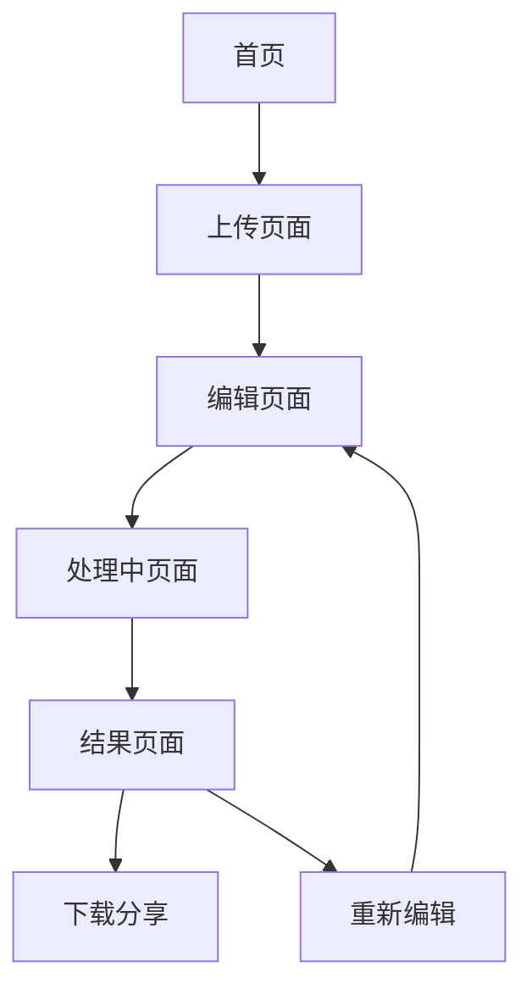

## 1. 产品概述
AI自动剪辑应用通过大模型API理解用户文本指令，自动分析上传的视频素材并执行智能剪辑，最终输出符合要求的成品视频。

该产品解决了传统视频剪辑门槛高、耗时长的痛点，让普通用户通过自然语言描述即可获得专业级剪辑效果，大幅降低视频创作门槛。

## 2. 核心功能

### 2.1 用户角色
| 角色 | 注册方式 | 核心权限 |
|------|----------|----------|
| 普通用户 | 邮箱注册 | 上传素材、提交剪辑任务、下载成品 |
| 高级用户 | 付费升级 | 批量处理、高级模板、优先处理队列 |

### 2.2 功能模块
核心页面包括：
1. **首页**：功能介绍、上传入口、示例展示
2. **上传页面**：素材上传、预览确认、基本信息填写
3. **编辑页面**：文本指令输入、参数调整、实时预览
4. **结果页面**：进度显示、成品预览、下载分享

### 2.3 页面详情
| 页面名称 | 模块名称 | 功能描述 |
|----------|----------|----------|
| 首页 | 功能介绍区 | 展示产品核心能力和使用场景 |
| 首页 | 快速上传入口 | 支持拖拽上传和点击选择视频文件 |
| 首页 | 示例展示区 | 轮播展示剪辑前后的对比效果 |
| 上传页面 | 素材上传模块 | 支持多格式视频上传，实时显示上传进度 |
| 上传页面 | 素材预览模块 | 上传完成后可播放预览原视频 |
| 上传页面 | 基本信息填写 | 输入视频标题、描述等元信息 |
| 编辑页面 | 文本指令输入 | 用户用自然语言描述剪辑需求 |
| 编辑页面 | 参数调整面板 | 可选调整输出格式、分辨率等参数 |
| 编辑页面 | 实时预览窗口 | 显示AI解析后的剪辑计划预览 |
| 结果页面 | 进度显示模块 | 实时显示剪辑处理进度百分比 |
| 结果页面 | 成品预览播放器 | 处理完成后可在线观看成品 |
| 结果页面 | 下载分享功能 | 支持下载到本地和分享到社交平台 |

## 3. 核心流程
用户操作流程：
1. 用户访问首页，了解产品功能
2. 点击上传按钮，选择本地视频文件
3. 上传完成后预览素材，确认无误
4. 在编辑页面输入剪辑指令，如"剪掉前10秒，添加背景音乐，制作1分钟精简版"
5. 系统调用大模型API解析指令，生成剪辑计划
6. 后端视频处理引擎执行剪辑任务
7. 用户可在结果页面查看进度和最终成品
8. 下载或分享剪辑完成的视频

## 4. 用户界面设计

### 4.1 设计风格
- **主色调**：深蓝色(#1E3A8A)搭配白色背景，体现科技感
- **按钮样式**：圆角矩形设计，主要操作为实心填充，次要操作为边框样式
- **字体选择**：中文使用思源黑体，英文使用Inter，正文字号14-16px
- **布局风格**：卡片式布局，内容分区清晰，支持响应式网格
- **图标风格**：使用线性图标，保持简洁统一的视觉风格

### 4.2 页面设计概览
| 页面名称 | 模块名称 | UI元素 |
|----------|----------|--------|
| 首页 | 功能介绍区 | 全屏背景视频，叠加半透明黑色蒙版，白色大标题文字 |
| 首页 | 上传入口 | 中央位置的虚线框拖拽区域，支持多文件拖拽 |
| 上传页面 | 素材预览 | 左侧视频播放器，右侧文件信息和上传进度条 |
| 编辑页面 | 指令输入 | 大文本输入框，支持多行输入，配有示例提示 |
| 编辑页面 | 参数面板 | 折叠式侧边栏，包含格式、分辨率等选项 |
| 结果页面 | 进度显示 | 圆形进度条配合百分比数字，下方显示当前处理步骤 |
| 结果页面 | 成品预览 | 全宽视频播放器，底部控制条，右侧下载按钮 |

### 4.3 响应式设计
采用桌面端优先设计，支持1920px、1440px、1024px断点，移动端适配至375px宽度。触摸交互优化包括更大的点击区域和手势支持。