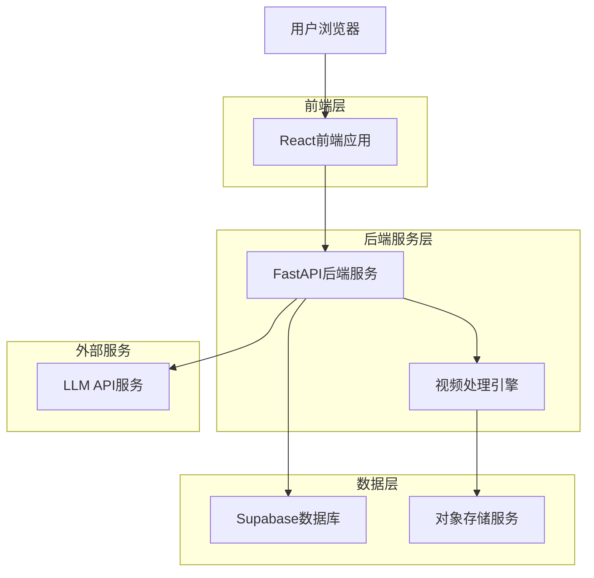
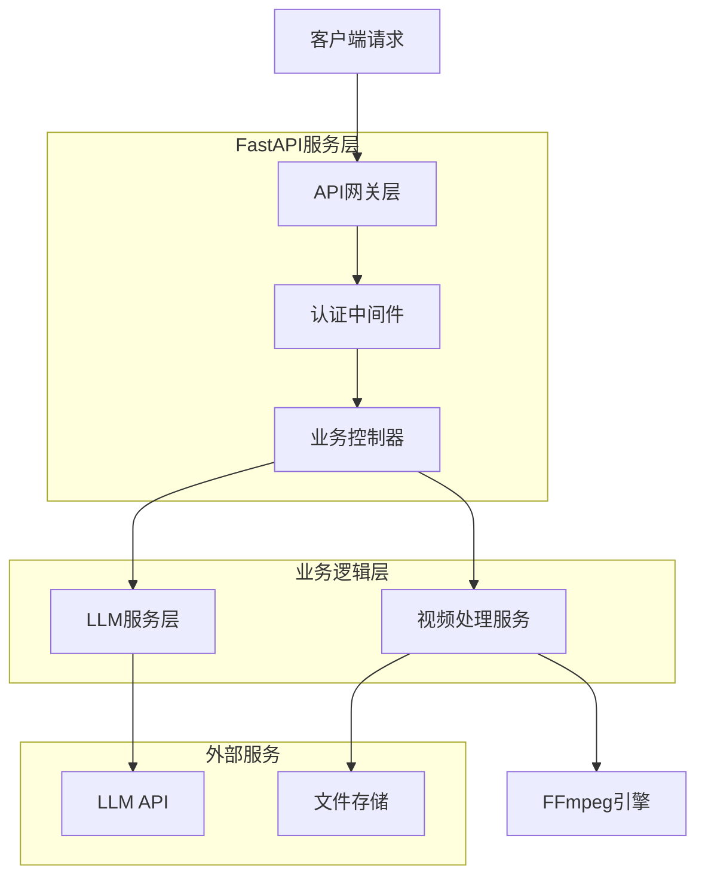
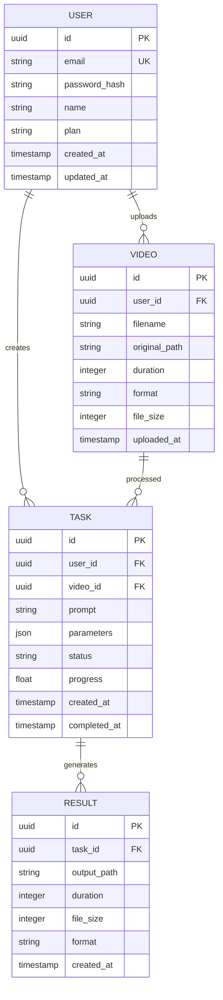

## 1. 架构设计



## 2. 技术栈描述

* **前端**: React\@18 + TypeScript + TailwindCSS\@3 + Vite

* **初始化工具**: vite-init

* **后端**: FastAPI\@0.104 + Python\@3.11

* **数据库**: Supabase (PostgreSQL)

* **视频处理**: FFmpeg + MoviePy

* **文件存储**: Supabase Storage

* **大模型API**: OpenAI GPT-4 / Claude / 文心一言

## 3. 路由定义

| 路由          | 用途               |
| ----------- | ---------------- |
| /           | 首页，产品功能介绍和快速上传入口 |
| /upload     | 上传页面，素材上传和预览     |
| /edit       | 编辑页面，文本指令输入和参数设置 |
| /processing | 处理中页面，显示剪辑进度     |
| /result     | 结果页面，成品预览和下载     |
| /login      | 登录页面，用户身份验证      |
| /register   | 注册页面，新用户注册       |
| /dashboard  | 用户中心，历史任务管理      |

## 4. API定义

### 4.1 核心API

**用户认证相关**

```
POST /api/auth/register
```

请求:

| 参数名      | 参数类型   | 是否必需 | 描述     |
| -------- | ------ | ---- | ------ |
| email    | string | true | 用户邮箱地址 |
| password | string | true | 用户密码   |
| name     | string | true | 用户昵称   |

响应:

| 参数名      | 参数类型   | 描述      |
| -------- | ------ | ------- |
| user\_id | string | 用户唯一标识  |
| token    | string | JWT认证令牌 |

**素材上传**

```
POST /api/video/upload
```

请求:

| 参数名         | 参数类型   | 是否必需  | 描述   |
| ----------- | ------ | ----- | ---- |
| file        | File   | true  | 视频文件 |
| title       | string | false | 视频标题 |
| description | string | false | 视频描述 |

响应:

| 参数名         | 参数类型   | 描述     |
| ----------- | ------ | ------ |
| video\_id   | string | 视频唯一标识 |
| upload\_url | string | 上传地址   |
| status      | string | 上传状态   |

**创建剪辑任务**

```
POST /api/video/edit
```

请求:

| 参数名        | 参数类型   | 是否必需  | 描述     |
| ---------- | ------ | ----- | ------ |
| video\_id  | string | true  | 原视频ID  |
| prompt     | string | true  | 剪辑指令文本 |
| parameters | object | false | 输出参数设置 |

响应:

| 参数名             | 参数类型   | 描述        |
| --------------- | ------ | --------- |
| task\_id        | string | 任务唯一标识    |
| status          | string | 任务状态      |
| estimated\_time | number | 预计处理时间(秒) |

**查询任务状态**

```
GET /api/video/task/{task_id}
```

响应:

| 参数名         | 参数类型   | 描述     |
| ----------- | ------ | ------ |
| task\_id    | string | 任务ID   |
| status      | string | 当前状态   |
| progress    | number | 进度百分比  |
| result\_url | string | 成品视频地址 |

## 5. 服务器架构图



## 6. 数据模型

### 6.1 数据模型定义



### 6.2 数据定义语言

**用户表 (users)**

```sql
-- 创建表
CREATE TABLE users (
    id UUID PRIMARY KEY DEFAULT gen_random_uuid(),
    email VARCHAR(255) UNIQUE NOT NULL,
    password_hash VARCHAR(255) NOT NULL,
    name VARCHAR(100) NOT NULL,
    plan VARCHAR(20) DEFAULT 'free' CHECK (plan IN ('free', 'premium', 'enterprise')),
    usage_count INTEGER DEFAULT 0,
    created_at TIMESTAMP WITH TIME ZONE DEFAULT NOW(),
    updated_at TIMESTAMP WITH TIME ZONE DEFAULT NOW()
);

-- 创建索引
CREATE INDEX idx_users_email ON users(email);
CREATE INDEX idx_users_plan ON users(plan);
```

**视频表 (videos)**

```sql
-- 创建表
CREATE TABLE videos (
    id UUID PRIMARY KEY DEFAULT gen_random_uuid(),
    user_id UUID REFERENCES users(id) ON DELETE CASCADE,
    filename VARCHAR(255) NOT NULL,
    original_path TEXT NOT NULL,
    duration INTEGER,
    format VARCHAR(10),
    file_size BIGINT,
    metadata JSONB,
    uploaded_at TIMESTAMP WITH TIME ZONE DEFAULT NOW()
);

-- 创建索引
CREATE INDEX idx_videos_user_id ON videos(user_id);
CREATE INDEX idx_videos_uploaded_at ON videos(uploaded_at DESC);
```

**任务表 (tasks)**

```sql
-- 创建表
CREATE TABLE tasks (
    id UUID PRIMARY KEY DEFAULT gen_random_uuid(),
    user_id UUID REFERENCES users(id) ON DELETE CASCADE,
    video_id UUID REFERENCES videos(id) ON DELETE CASCADE,
    prompt TEXT NOT NULL,
    parameters JSONB DEFAULT '{}',
    status VARCHAR(20) DEFAULT 'pending' CHECK (status IN ('pending', 'processing', 'completed', 'failed')),
    progress FLOAT DEFAULT 0.0 CHECK (progress >= 0 AND progress <= 100),
    error_message TEXT,
    created_at TIMESTAMP WITH TIME ZONE DEFAULT NOW(),
    started_at TIMESTAMP WITH TIME ZONE,
    completed_at TIMESTAMP WITH TIME ZONE
);

-- 创建索引
CREATE INDEX idx_tasks_user_id ON tasks(user_id);
CREATE INDEX idx_tasks_video_id ON tasks(video_id);
CREATE INDEX idx_tasks_status ON tasks(status);
CREATE INDEX idx_tasks_created_at ON tasks(created_at DESC);
```

**结果表 (results)**

```sql
-- 创建表
CREATE TABLE results (
    id UUID PRIMARY KEY DEFAULT gen_random_uuid(),
    task_id UUID REFERENCES tasks(id) ON DELETE CASCADE,
    output_path TEXT NOT NULL,
    duration INTEGER,
    file_size BIGINT,
    format VARCHAR(10),
    quality_metrics JSONB,
    created_at TIMESTAMP WITH TIME ZONE DEFAULT NOW()
);

-- 创建索引
CREATE INDEX idx_results_task_id ON results(task_id);
```

**权限设置**

```sql
-- 匿名用户基本权限
GRANT SELECT ON users TO anon;
GRANT SELECT ON videos TO anon;
GRANT SELECT ON tasks TO anon;
GRANT SELECT ON results TO anon;

-- 认证用户完整权限
GRANT ALL PRIVILEGES ON users TO authenticated;
GRANT ALL PRIVILEGES ON videos TO authenticated;
GRANT ALL PRIVILEGES ON tasks TO authenticated;
GRANT ALL PRIVILEGES ON results TO authenticated;
```

